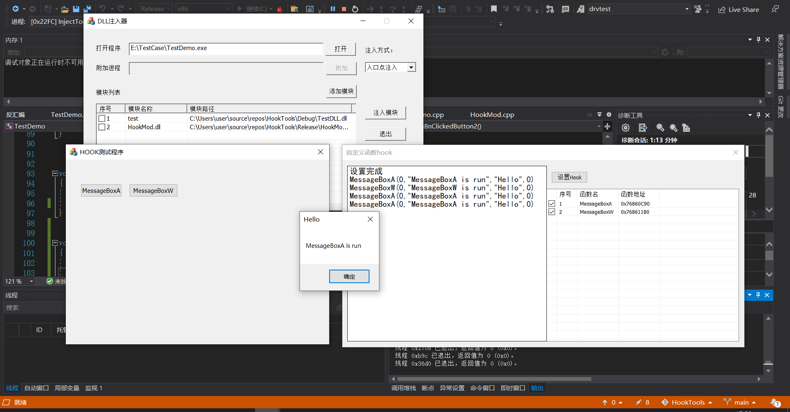
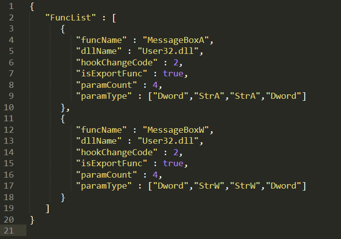

# HookTools

## 项目概述
一款Windows平台的Hook工具，能快速对目标代码进行Hook操作。
## 开发环境
vs2019
## 主要功能
1. 注入器
    1. - [x] 支持入口点注入模式。
    2. - [x] 支持远程线程注入模式。
    3. - [x] 对注入模块进行统一的增，删，改操作。
    4. - [ ] 添加调试器，方便对正在注入的程序进行调试。
    5. - [ ] Hook模块的卸载。
2. 主Hook模块
    1. - [x] 按”Home“键显示主界面。
    2. - [x] 能获取被Hook的api的调用参数。
    3. - [x] 支持int 3异常Hook。
    4. - [ ] 支持短跳Hook。
    5. - [ ] 支持硬件Hook。 
    6. - [x] 根据配置文件，对系统API进行Hook。
    7. - [ ] 通过UI界面添加Hook配置。
    8. - [ ]  对于非导出函数能通过特征码定位，实现Hook。
    9. - [ ] 引入反汇编引擎，减少配置所需参数。

## 目前项目演示
### 运行效果

## 文件目录
HookMod：主Hook模块  
HookTools：注入器  
TestDLL：测试模块，无实际功能  
TestDemo：被注入的测试程序，主要调用了一些Windows API  
## 配置信息
funcName： 导出函数API名称  
dllName： 导出函数所在DLL  
hookChangeCode：Hook点所影响的汇编代码的长度  
isExportFunc：是否是导出函数  
paramCount：要Hook的API的参数个数  
paramType：要Hook的API的参数类型（Dword为4字节整数，StrA为多字节编码字符串，StrW为宽字节编码字符串  
### 配置文件

